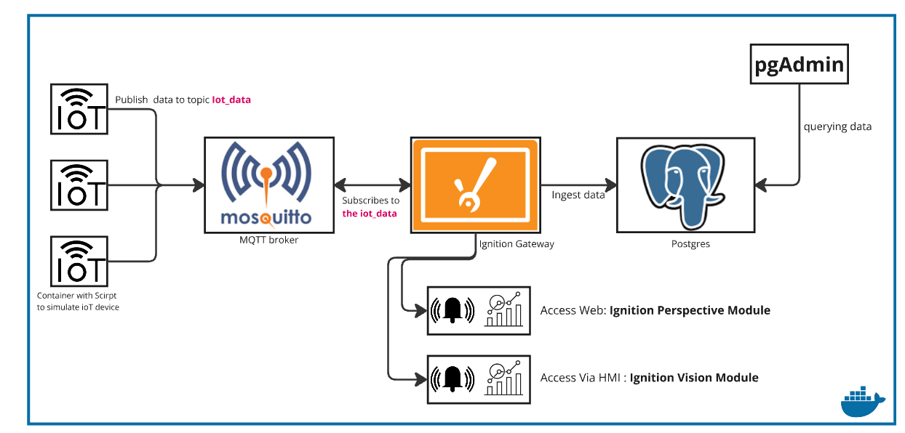
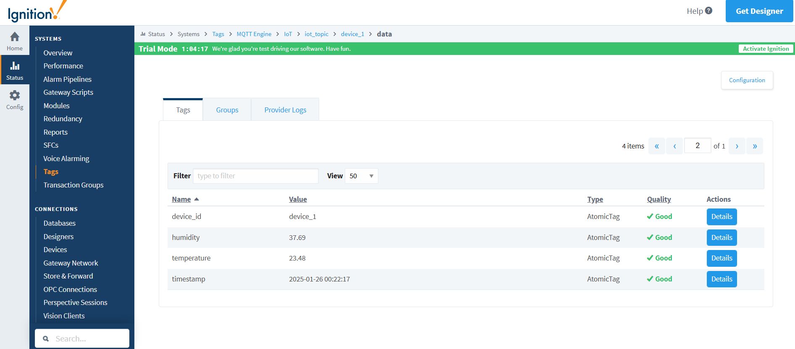
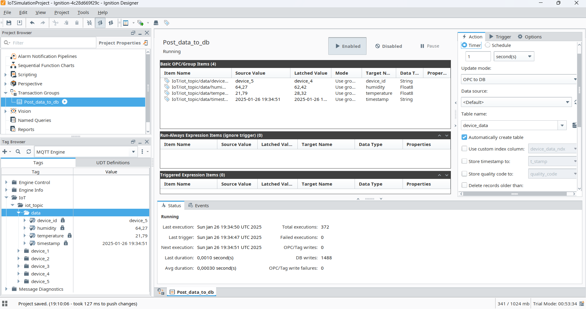
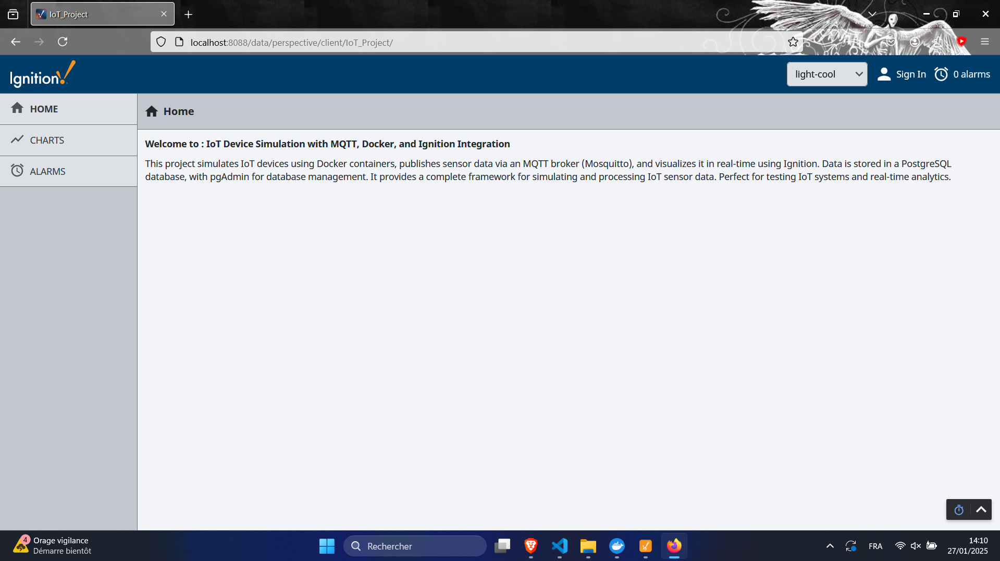
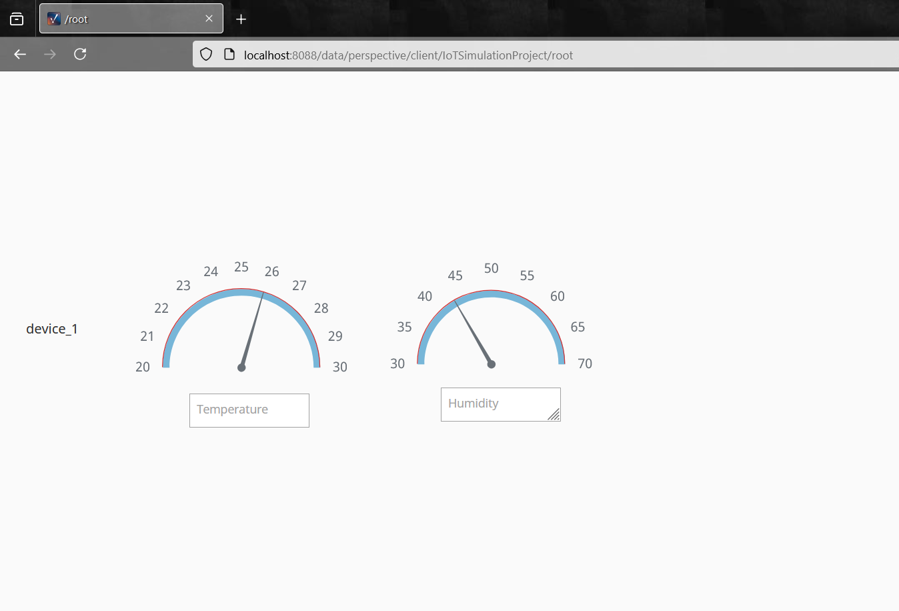
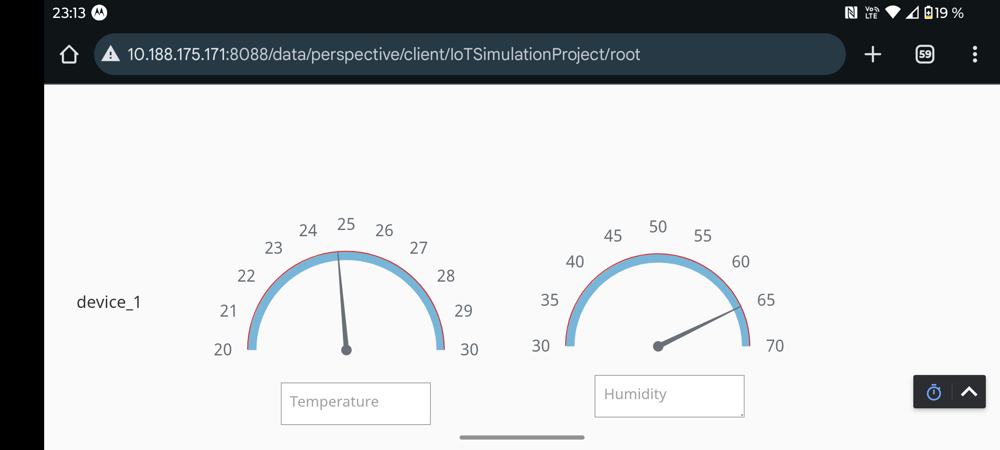
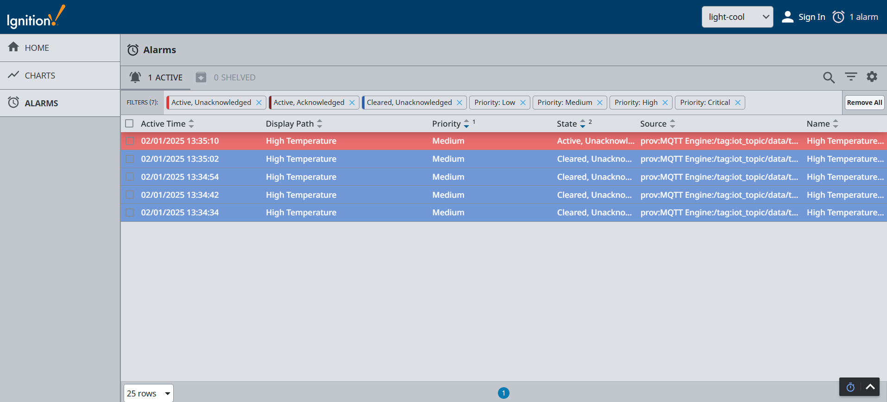
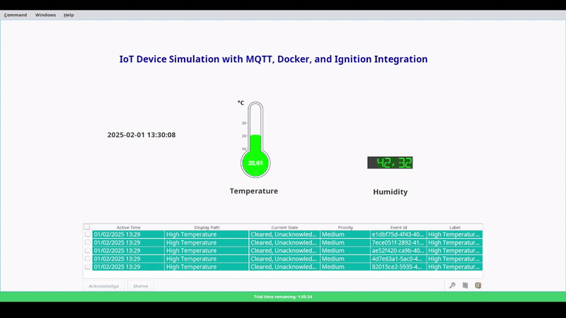
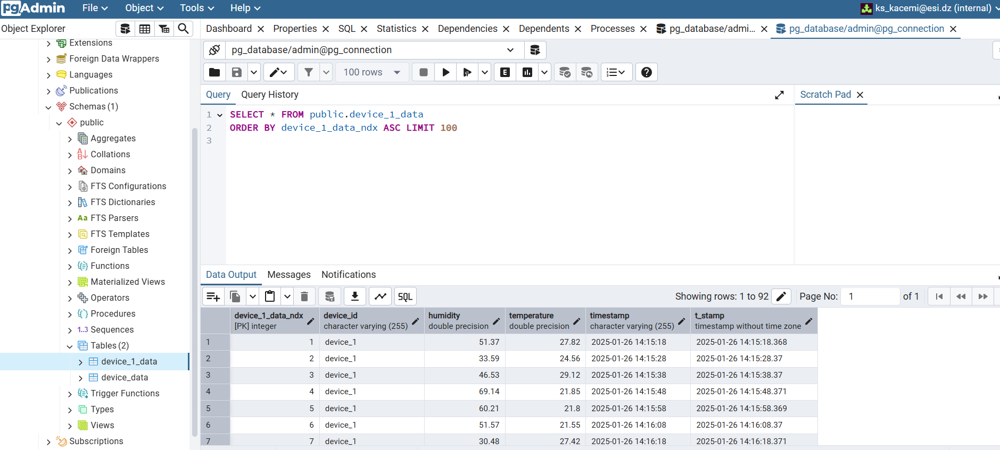

# IoT Device Simulation with MQTT, Docker, and Ignition Integration

This project simulates IoT devices using Docker containers, publishes sensor data through an MQTT broker (Mosquitto), and visualizes the data in real-time using Ignition. Ignition is also utilized for setting up alarms based on real-time data thresholds. The data is stored in a PostgreSQL database and managed via pgAdmin. This framework offers a comprehensive solution for simulating, processing, and visualizing IoT sensor data, making it an ideal tool for testing IoT systems and enabling real-time analytics.

Aligned with Industry 4.0 principles, the project emphasizes interconnected systems, real-time data processing, and smart automation. By integrating IoT simulation, real-time monitoring, and advanced data storage, it provides a scalable foundation for smart manufacturing, predictive maintenance, and data-driven decision-making.

---

## Table of Contents
1. [Architecture Overview](#architecture-overview)
2. [Features](#features)
3. [Requirements](#requirements)
4. [Setup and Configuration](#setup-and-configuration)
5. [Visualization and Monitoring](#visualization-and-monitoring)
   - [Ignition Web Interface](#ignition-web-interface)
   - [Ignition Dashboard (Perspective Module)](#ignition-dashboard-perspective-module)
   - [Ignition Alarms](#ignition-alarms)
   - [Vision Client Launcher](#vision-client-launcher)
6. [Database Management](#database-management)
7. [Technical Notes](#technical-notes)

---

## Architecture Overview

The system consists of the following components:
- **IoT Device Simulators**: Docker containers generating sensor data (e.g., temperature, humidity).
- **MQTT Broker (Mosquitto)**: Handles communication between IoT devices and Ignition.
- **Ignition**: Subscribes to MQTT topics, processes real-time data, and visualizes it via dashboards.
- **PostgreSQL**: Stores sensor data for long-term analysis.
- **pgAdmin**: Provides a user-friendly interface for managing the PostgreSQL database.

---

## Features
- **IoT Device Simulation**: Simulate multiple IoT devices generating various types of sensor data (e.g., temperature, humidity).
- **MQTT Communication**: Devices publish sensor data to an MQTT broker using the MQTT protocol.
- **Real-Time Data Visualization**: Configure Ignition's MQTT Engine module to subscribe to the broker and retrieve real-time data.
- **Data Storage**: Ignition sends real-time data to PostgreSQL for persistent storage.
- **Database Management**: Use pgAdmin to query and manage data stored in PostgreSQL.
- **Interactive Dashboards**: Build real-time dashboards in Ignition Perspective for data visualization.
- **Cross-Platform Access**: Access dashboards and alarms via web browsers or mobile devices.

---

## Requirements
To run this project, you need the following:
- **Docker**: For containerizing IoT device simulators.
- **Mosquitto**: MQTT broker for handling device communication.
- **Ignition**: SCADA platform with the MQTT Engine module (.modl) installed.
- **PostgreSQL**: Database server for storing sensor data.
- **pgAdmin**: Web-based interface for managing PostgreSQL databases.

---

## Setup and Configuration
1. **IoT Device Simulation**: Use Docker to simulate IoT devices. Each device publishes sensor data to the MQTT broker.
2. **MQTT Broker**: Set up Mosquitto to handle MQTT communication.
3. **Ignition Configuration**:
   - Install the MQTT Engine module.
   - Configure Ignition to subscribe to MQTT topics and retrieve real-time data.
   - Connect Ignition to PostgreSQL for data storage.
4. **Database Setup**: Configure PostgreSQL and pgAdmin for data management.
5. **Dashboard Creation**: Use Ignition Perspective to build interactive dashboards for real-time data visualization.

---

## Visualization and Monitoring

### Ignition Web Interface

### Ignition Designer Interface

### Ignition Dashboard (Perspective Module)
Access dashboards via web or mobile devices for real-time monitoring.

#### Web Access

#### Mobile Access

### Ignition Alarms
Monitor and manage alarms via the Ignition Perspective module.

### Vision Client Launcher
Launch dashboards and alarms using the Vision Client.

---

## Database Management
Use pgAdmin to query and manage data stored in PostgreSQL.

---

## Technical Notes
- **MQTT Protocol**: MQTT is an Application Layer (Layer 7) protocol designed for lightweight IoT communication. It operates on top of the OSI model, enabling scalable, reliable, and bandwidth-efficient messaging.
- **IoT Communication**: Devices connect to the internet via Wi-Fi, Ethernet, or Cellular (Layer 1-2), obtain an IP address (Layer 3), and establish a TCP connection (Layer 4) with an MQTT broker. The broker manages sessions (Layer 5), while devices exchange structured JSON messages (Layer 6) through MQTT’s publish/subscribe model (Layer 7).
- **Advantages of MQTT**: Unlike direct IP communication, MQTT enables scalable, reliable, and bandwidth-efficient messaging across firewalls and NAT, making it ideal for IoT applications.
- [**MQTT Engine Module**](https://inductiveautomation.com/resources/video/mqtt-engine-module): Enables Ignition to act as an MQTT client, subscribing to topics and processing real-time data.

---