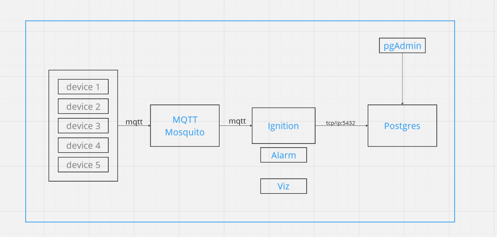
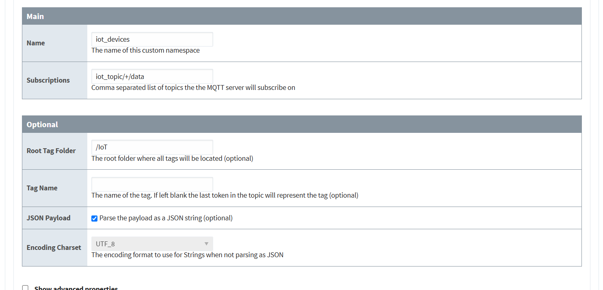

# IoT Device Simulation with MQTT, Docker, and Ignition Integration

This project simulates IoT devices using Docker containers, publishes sensor data via an MQTT broker (Mosquitto), and visualizes it in real-time using Ignition. Data is stored in a PostgreSQL database, with pgAdmin for database management. It provides a complete framework for simulating and processing IoT sensor data. Perfect for testing IoT systems and real-time analytics.

## Features
- Simulates multiple IoT devices with sensor data (temperature, humidity).
- Publishes data over MQTT using Mosquitto broker.
- Integrates with Ignition for real-time data visualization.
- Runs entirely in Docker containers for ease of setup.

## Requirements
- Docker
- Docker Compose
- Ignition (for visualization)

## Project Structure

---

## Setup and Running the Project

### 1. Build the Docker containers
To build the Docker containers for the project, use the following command:

docker compose build

### 2. Start the containers in detached mode
Once the containers are built, you can start them using:

docker compose up -d

### 3. Inspect Docker Network (optional)
You can inspect the Docker network to check the configuration and the containers in use:

docker network inspect iotdevicesimulationandscadaintegrationwithignition_default

---

## MQTT Commands

### 1. Subscribe to MQTT topic
To subscribe to a specific MQTT topic (e.g., for sensor data), use:

mosquitto_sub -h localhost -t "iot_topic/data"

### 2. Subscribe to all MQTT topics
To listen to all available MQTT topics, use:

mosquitto_sub -h localhost -t "#" -v

---

