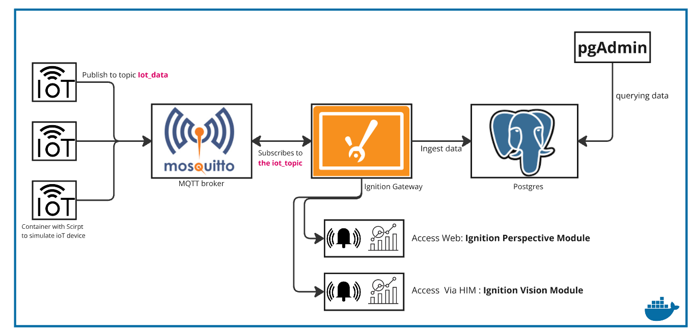
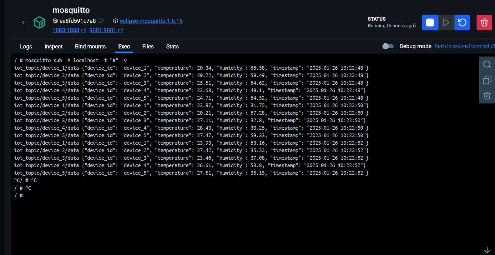

# IoT Device Simulation with MQTT, Docker, and Ignition Integration

This project simulates IoT devices using Docker containers, publishes sensor data via an MQTT broker (Mosquitto), and visualizes it in real-time using Ignition. Data is stored in a PostgreSQL database, with pgAdmin for database management. It provides a complete framework for simulating and processing IoT sensor data. Perfect for testing IoT systems and real-time analytics.

## Architecture Overview

## Features

- Simulate multiple IoT devices that generate various types of sensor data (e.g., temperature, humidity).

- Each IoT device publishes its sensor data to an MQTT broker (Mosquitto) using the MQTT protocol.

- Configure the MQTT Engine module in Ignition to subscribe to the MQTT broker and retrieve real-time data from the IoT devices.

- Establish a connection between Ignition and PostgreSQL, allowing Ignition to send the real-time data to PostgreSQL for storage.

- Set up pgAdmin to query and manage the data stored in PostgreSQL, providing a user-friendly interface for data management.

- Build a dashboard in Ignition Perspective to visualize the real-time data retrieved from the sensors.

## Requirements
- Docker container for simulating iot-device
- Mosquitto (MQTT Broker)
- Ignition + MQTT Engine Module (.modl)
- PostgreSQL (DB server)
- pgAdmin (DB-Interface )

## Overview of Mosquitto Terminal

## Ignition Web Interface (Tags)

## Ignition Designer Interface

## Ignition Dashboard (Perspective Module) :  Acces from the web
 

### Ignition Alarm (Perspective Module) 

### Vision Client Launcher : Dashboard and Alarm

## PostgreSQL Data from pgAdmin

### Note

MQTT is an Application Layer (Layer 7) protocol designed for lightweight IoT communication, running on top of the OSI model. IoT devices connect to the internet via Wi-Fi, Ethernet, or Cellular (Layer 1-2), obtain an IP address (Layer 3), and establish a TCP connection (Layer 4) with an MQTT broker. The broker manages sessions (Layer 5), while devices exchange structured JSON messages (Layer 6) through MQTT’s publish/subscribe model (Layer 7). Unlike direct IP communication, MQTT enables scalable, reliable, and bandwidth-efficient messaging across firewalls and NAT, making it ideal for IoT applications. 